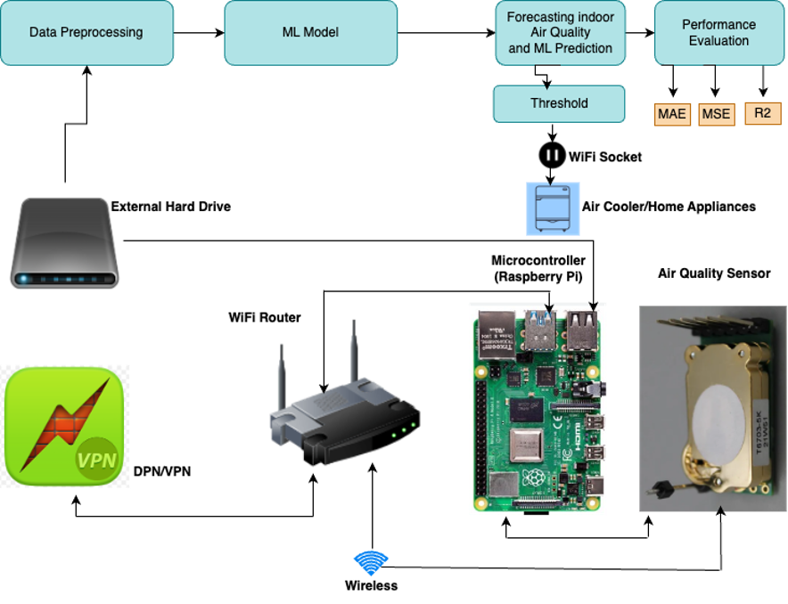
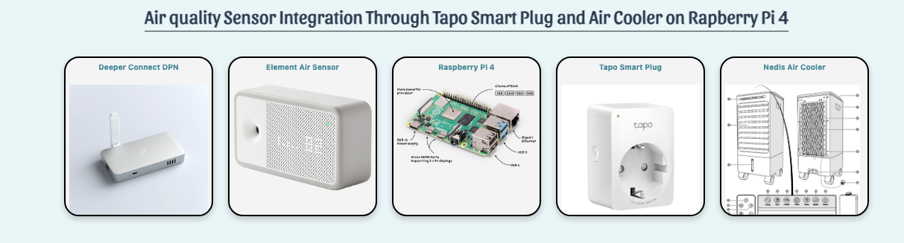

# Home Automation System

This project integrates various technologies to enhance network security, data management, and user experience in a home automation environment.

## Table of Contents

- [Overview](#overview)
- [Components](#components)
  - [Home Internet](#home-internet)
  - [Deeper Connect (DPN)](#deeper-connect-dpn)
  - [Wireless Router](#wireless-router)
  - [Air Quality Sensor](#air-quality-sensor)
  - [Raspberry Pi 4](#raspberry-pi-4)
  - [External Hard Drive](#external-hard-drive)
  - [TaPo Mini Smart Wi-Fi Socket](#tapo-mini-smart-wi-fi-socket)
  - [Home Appliances](#home-appliances)
- [Frontend](#frontend)
  - [User Interface (UI)](#user-interface-ui)
  - [Data Visualization](#data-visualization)
  - [Notification System](#notification-system)
  - [Accessibility and Responsiveness](#accessibility-and-responsiveness)
- [Backend](#backend)
  - [Programming Language and Framework](#programming-language-and-framework)
  - [Database](#database)
  - [Data Collection and Processing](#data-collection-and-processing)
  - [Hosting](#hosting)
  - [Security](#security)
  - [Scalability](#scalability)
- [Overall Architecture](#overall-architecture)

## Overview

This document outlines the components and architecture of a smart home automation system, focusing on security, data collection, and user interaction.

## Components

### Home Internet
- **Home Internet Sockets**: Provide built-in internet services offered by DNA, connected to DPN.

### Deeper Connect (DPN)
- **Overview**: The Deeper Network offers comprehensive protection for our network and data.
- **Capabilities**: Creates secure encrypted tunnels over public networks, allowing remote access securely.
- **Features**:
  - DPN
  - Enterprise-grade cybersecurity
  - Secure gateway for IoT devices
  - Ad blocking (including on YouTube)
  - Simple plug-and-play setup

### Wireless Router
- **Function**: Connected to Deeper Connect, securing the entire home internet.

### Air Quality Sensor
- **Device**: Awair Element
- **Usage**: Monitors indoor air quality; provides accurate and reliable data.
- **Calibration**: Essential for high-quality data collection.

### Raspberry Pi 4
- **Role**: Central node for integrating all scripts, including sensor connections.
- **Configuration**:
  - **RAM**: 8 GB LPDDR4-2400 SDRAM
  - **CPU**: 1.5 GHz Broadcom BCM2711 Quad-core
  - **Connectivity**: Bluetooth 5.0, Dual-band Wi-Fi
  - **Ports**: 2 x micro-HDMI, 3.5 mm audio, Gigabit Ethernet, 4 x USB
  - **Power**: 15 W via USB-C or GPIO connector; PoE supported.

### External Hard Drive
- **Capacity**: 500GB
- **Purpose**: Data storage for collected data; integrated with PostgreSQL database in a Docker container for future use and visualization.

### TaPo Mini Smart Wi-Fi Socket
- **Functionality**: Remote-controlled smart socket managed through a smart device.
- **Features**:
  - API calls available on pypi.org
  - Calculates electricity costs and consumption
  - Automated control based on set thresholds
  - **Model**: Tapo P100
  - Compatibility: Works with Amazon Alexa and Google Assistant.

### Home Appliances
- **Definition**: Includes various smart devices such as thermostats, lighting, locks, sensors, TVs, and security systems.

## Frontend

### User Interface (UI)
- **Technologies**: HTML, CSS, Bootstrap, JavaScript
- **Design**: Intuitive dashboard for real-time air quality data, trends, and alerts.

### Data Visualization
- **Approach**: Utilizes graphs, charts, and maps for easy data interpretation.
- **Tools**: Advanced visualization using Matplotlib.

### Notification System
- **Functionality**: Alerts users about device automation via email.

### Accessibility and Responsiveness
- **Compatibility**: Designed for desktops, tablets, and smartphones; adheres to web accessibility standards.

## Backend

### Programming Language and Framework
- **Technology Used**: Core Python and Flask for data analysis and backend development.

### Database
- **Structure**: Stores sensor and machine learning prediction data in CSV, JSON, and PostgreSQL formats.

### Data Collection and Processing
- **Procedure**: Collects data from sensors, preprocesses it, and deploys machine learning models for predictions.

### Hosting
- **Current Stage**: Port forwarding for testing; plans for a personal domain with DNS and SSL in the future.

### Security
- **Protection**: Entire network secured with DPN, safeguarding all IoT devices and data.

### Scalability
- **Storage Capacity**: Currently using a 500 GB external hard drive, with options to scale as needed.

## Overall Architecture
- **Data Flow**: Sensors → Data Processing (Backend) → Database → Data Retrieval (API) → Data Visualization (Frontend).
- **Scalability and Reliability**: Utilizing port forwarding, public IP, domain name, SSL, DPN, and expandable storage.
- **Security**: Ensuring secure data transfer, storage, and user authentication through DPN.
